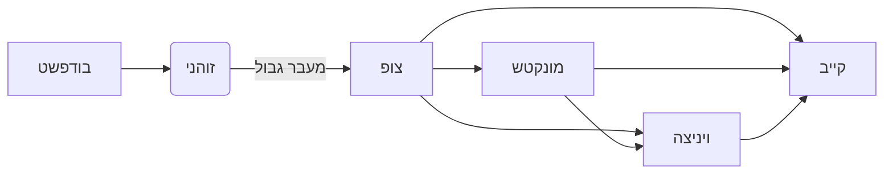
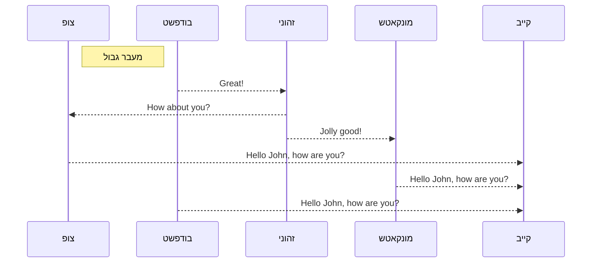
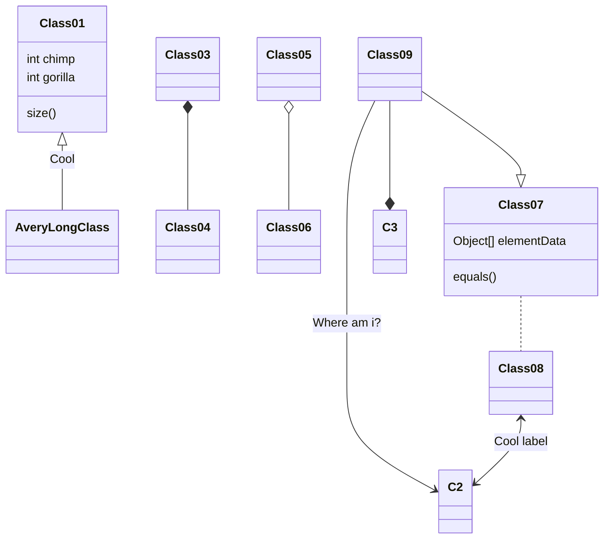
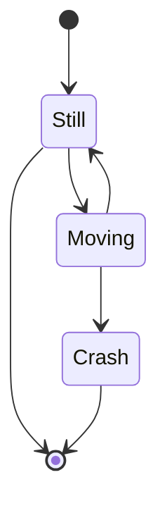

### עד עכשיו נרשמו


| קו | מוצא | יעד | שעת יציאה | שעת הגעה | מסלול | שונות |
| :---  | :---:  | :---:  | :---:  | :---: | :---:  | ---:  |
| רכבת מקייב לבופשט :arrow_down: 
| 91 | קייב פאס | בודפשט | 14:25 | 08:40 | קייב וינה | קניית הכרטיס באתר האוסטרי ולא בהונגרי |
| רכבות ממוקאצ'בו לבודפשט :arrow_down: 
| 145 | מוקאצ'בו | בודפשט | 00:24 | 08:40 | מוקאצ'בו וינה | קניית הכרטיס באתר האסטרי ולא בהונגרי |
| 33 | מוקאצ'בו | בודפשט | 12:30 | 18:37 | מוקאצ'בו בודפשט |  |
| 31 | מוקאצ'בו | בודפשט | 16:30 | 22:37 | מוקצ'בו בודפשט |  |
| רכבות מצ'ופ לבודפשט :arrow_down: 
| 33 | צ'ופ | בודפשט | 14:10 | 18:37 | מוקאצ'בו בודפשט |  |
|31 | צ'ופ | בודפשט | 18:15 | 22:37 | מוקאצ'בו בודפשט |  |
| רכבות מצ'ופ לזהוני :arrow_down: 
| 6281 | צ'ופ | זהוני | 05:29 | 04:47 |  | |
| 6283 | צ'ופ | זהוני | 08:29 | 07:40 | |  | 
| 6285 | צ'ופ | זהוני | 10:25 | 09:43 |  |  |
| 6287 | צ'ופ | זהוני | 16:12 | 15:30 |  |  |
| 6289 | צ'ופ | זהוני | 20:25 | 19:43 |  |  |
| 6291 | צ'ופ | זהוני | 22:29 | 21:47 |  |  |
| רכבות מזהוני לבודפשט  :arrow_down:                                               
| 140 | זהוני | בודפשט | 04:05 | 08:20 | ? |  |
| 619 | זהוני | בודפשט | 05:35 | 09:37 |   |  |
| 617 | זהוני | בודפשט | 08:40 | 12:37 |  |  | 
| 33 | זהוני | בודפשט | 14:40 | 18:37 | ממוקאצ'בו לבודפשט |  |
| 31 | זהוני | בדפשט | 18:40 | 22:37 | ממוקאצ'בו לבודפשט |   |
### אפשרות ב

| קו | שם | בודפשט | זהוני | צ'ופ | מונקטש | שונות |
| :---  | :---:  | :---:  | :---:  | :---: | :---:  | ---:  |
| 145 | קייב -> וינה | 10:10 | 00:24 | 08:40 | 10:10 | קניית הכרטיס באתר האסטרי ולא בהונגרי |
| 1 | מוצא -> יעד | 10:10 | 00:24 | 08:40 | 10:10 |  |
| 2 | מוצא -> יעד | 10:10 | 00:24 | 08:40 | 10:10 |  |
| 3 | מוצא -> יעד | 10:10 | 00:24 | 08:40 | 10:10 |  |
| 4 | מוצא -> יעד | 10:10 | 00:24 | 08:40 | 10:10 |  |
| 5 | מוצא -> יעד | 10:10 | 00:24 | 08:40 | 10:10 |  |
| 6 | מוצא -> יעד | 10:10 | 00:24 | 08:40 | 10:10 |  |
| 7 | מוצא -> יעד | 10:10 | 00:24 | 08:40 | 10:10 |  |
| 8 | מוצא -> יעד | 10:10 | 00:24 | 08:40 | 10:10 |  |

### תרשים סוג א

```markmap

  - בודפשט
     - זוהני
        - צופ
        - מונקטש
```

### תרשים סוג 2



### Callouts


{}
שימו לב הודעה חשובה{}

{}
שימו לב אזהרה
{}
### Spoilers

ככה  נראה  הודעה נסתרת (ספווילר)


 You found me! 










