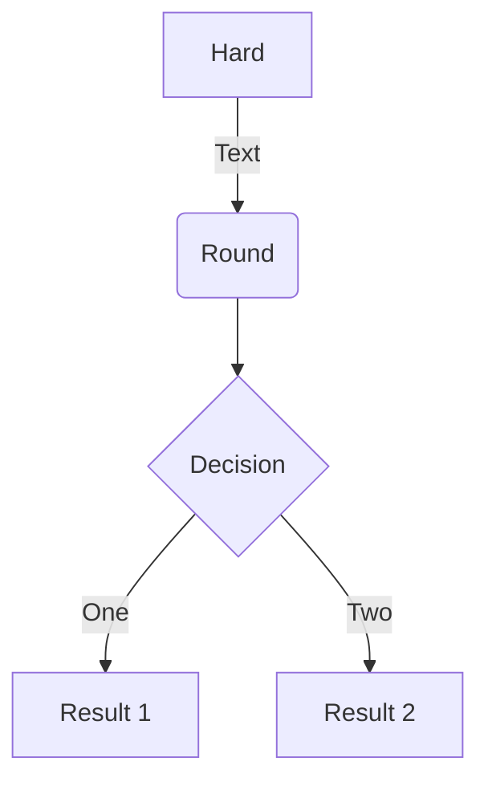
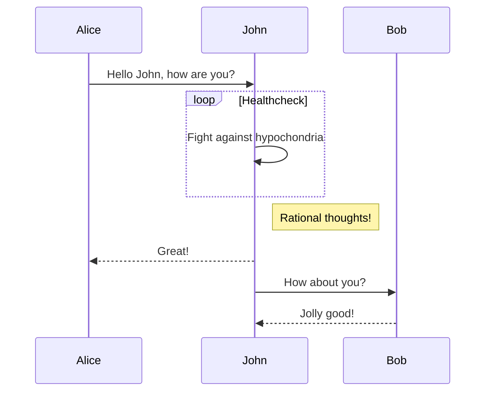
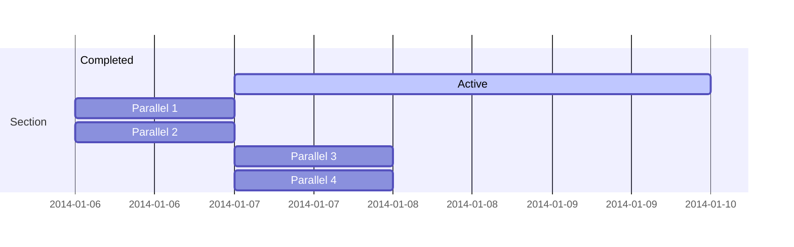
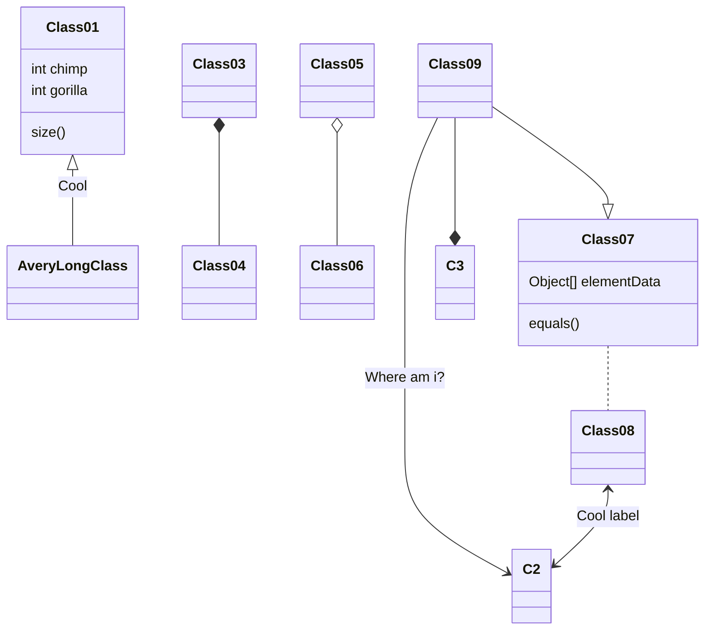
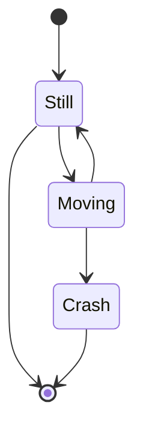

### Mindmaps


renders as

```markmap {height="200px"}
- Hugo Modules
  - wowchemy
  - wowchemy-plugins-netlify
  - wowchemy-plugins-netlify-cms
  - wowchemy-plugins-reveal
```

A more advanced mindmap with formatting, code blocks, and math:

<div class="highlight">
<pre class="chroma">
<code>
```markmap
- Mindmaps
  - Links
    - [Wowchemy Docs](https://wowchemy.com/docs/)
    - [Discord Community](https://discord.gg/z8wNYzb)
    - [GitHub](https://github.com/wowchemy/wowchemy-hugo-themes)
  - Features
    - Markdown formatting
    - **inline** ~~text~~ *styles*
    - multiline
      text
    - `inline code`
    -
      ```js
      console.log('hello');
      console.log('code block');
      ```
    - Math: $x = {-b \pm \sqrt{b^2-4ac} \over 2a}$
```
</code>
</pre>
</div>

renders as

```markmap
- Mindmaps
  - Links
    - [Wowchemy Docs](https://wowchemy.com/docs/)
    - [Discord Community](https://discord.gg/z8wNYzb)
    - [GitHub](https://github.com/wowchemy/wowchemy-hugo-themes)
  - Features
    - Markdown formatting
    - **inline** ~~text~~ *styles*
    - multiline
      text
    - `inline code`
    -
      ```js
      console.log('hello');
      console.log('code block');
      ```
    - Math: $x = {-b \pm \sqrt{b^2-4ac} \over 2a}$
```


### Diagrams

Wowchemy supports a Markdown extension for diagrams. You can enable this feature by toggling the `diagram` option in your `config/_default/params.toml` file or by adding `diagram: true` to your page front matter.

An example **flowchart**:

    ```mermaid
    graph TD
    A[Hard] -->|Text| B(Round)
    B --> C{Decision}
    C -->|One| D[Result 1]
    C -->|Two| E[Result 2]
    ```

renders as



An example **sequence diagram**:

    ```mermaid
    sequenceDiagram
    Alice->>John: Hello John, how are you?
    loop Healthcheck
        John->>John: Fight against hypochondria
    end
    Note right of John: Rational thoughts!
    John-->>Alice: Great!
    John->>Bob: How about you?
    Bob-->>John: Jolly good!
    ```

renders as



An example **Gantt diagram**:

    ```mermaid
    gantt
    section Section
    Completed :done,    des1, 2014-01-06,2014-01-08
    Active        :active,  des2, 2014-01-07, 3d
    Parallel 1   :         des3, after des1, 1d
    Parallel 2   :         des4, after des1, 1d
    Parallel 3   :         des5, after des3, 1d
    Parallel 4   :         des6, after des4, 1d
    ```

renders as



An example **class diagram**:

    ```mermaid
    classDiagram
    Class01 <|-- AveryLongClass : Cool
    Class03 *-- Class04
    Class05 o-- Class06
    Class07 .. Class08
    Class09 --> C2 : Where am i?
    Class09 --* C3
    Class09 --|> Class07
    Class07 : equals()
    Class07 : Object[] elementData
    Class01 : size()
    Class01 : int chimp
    Class01 : int gorilla
    Class08 <--> C2: Cool label
    ```

renders as



An example **state diagram**:

    ```mermaid
    stateDiagram
    [*] --> Still
    Still --> [*]
    Still --> Moving
    Moving --> Still
    Moving --> Crash
    Crash --> [*]
    ```

renders as




### Callouts

Academic supports a [shortcode for callouts](https://wowchemy.com/docs/content/writing-markdown-latex/#callouts), also referred to as _asides_, _hints_, or _alerts_. By wrapping a paragraph in `{} ... {}`, it will render as an aside.

```markdown
{}
A Markdown aside is useful for displaying notices, hints, or definitions to your readers.
{}
```

renders as

{}
A Markdown aside is useful for displaying notices, hints, or definitions to your readers.
{}

### Spoilers

Add a spoiler to a page to reveal text, such as an answer to a question, after a button is clicked.

```markdown

You found me!

```

renders as

 You found me! 
